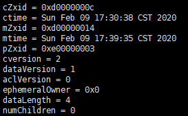

[toc]

# ZooKeeper：分布式应用的分布式协调服务

## 设计目标

**ZooKeeper很简单**。ZooKeeper 允许分布式进程通过与标准文件系统类似的共享分层命名空间相互协调。名称空间由**数据节点** （在 ZooKeeper 术语中称为 znodes）组成，这些节点与文件和目录类似。与专为存储而设计的典型文件系统不同，**ZooKeeper 数据保存在内存中**，这意味着 ZooKeeper 可以实现高吞吐量和低延迟。

**ZooKeeper可以被复制**。ZooKeeper本身也可以是分布式的，并且是**复制集群**。

这张图是一个ZooKeeper集群，ZooKeeper集群是主从模式的，Leader是主，其他Server是Fllower也就是从。Client将一般连接Fllower进行操作，只不过Fllower只能处理读操作，写操作需要Fllower去请求Leader进行处理。

**ZooKeeper是有序的**。由于写操作只能交给Leader单进程处理，所以是有顺序的。

**ZooKeeper很快**。ZooKeeper速度特别快，尤其是在读请求占总请求很大比例的时候。

## 数据模型和分层命名空间

ZooKeeper 提供的名称空间与标准文件系统的名称空间非常类似。名称是由斜杠 （/） 分隔的路径元素序列。ZooKeeper 名称空间中的每个节点都由路径标识。

## 节点和临时节点

与标准文件系统不同，ZooKeeper 命名空间中的**每个节点都可以包含与其关联的数据以及子级**。这就像有一个文件系统，允许文件也作为一个目录。ZooKeeper 旨在存储协调数据：状态信息、配置、位置信息等，因此存储在每个节点上的**数据通常很小**，最大1MB。

znode维护一个统计信息结构以及一个计数器，每进行一次操作计数器就+1。统计信息结构记录着这个节点的创建操作的id（cZxid）也就是这是第几个操作，取的是计数器的值。ctime是创建时间。mZxid和cZxid同理，mtime和ctime同理，不过是修改的信息。pZxid记录着这个节点的最后一个子节点的创建操作的id。

每znode上的数据以原子方式读取和写入。读取获取与znode关联的所有数据字节，写入将替换所有数据。

ZooKeeper有**临时节点**的概念。只要创建znode的会话（session）处于活动状态，这些znode就存在。会话结束时，znode将被删除。

ZooKeeper实际上还有一个**序列节点**，序列节点的前提使持久节点或者临时节点。序列节点保证不同的客户端写入的数据可以是相同的名字，因为序列节点会给他们的名字后面加上序号以分辨不同。

所以实际上ZooKeeper的节点有四种可能：

- 持久节点
- 持久序列节点
- 临时节点
- 临时序列节点

## 承诺

ZooKeeper非常快，非常简单。然而，由于它的目标是作为构建更复杂的服务（如同步）的基础，因此它提供了一套保证。它们是：

- **顺序一致性** - 来自客户端的更新将按发送顺序应用。
- **原子性** - 更新成功或失败。无部分结果。
- **单个系统映像** - 无论连接到哪个服务器，客户端都将看到服务的相同视图。
- **可靠性** - 应用更新后，该更新将从该时间一直持续，直到客户端覆盖更新。
- **及时性** - 保证系统的客户视图在一定时限内是最新的。

## 高性能

动物园管理员的设计是高性能的。确实如此吗？雅虎研究公司的动物园管理员开发团队的结果表明，这是正确的。但由于读写比率不同会发生变化。在读取次数超过写入次数的应用程序中，它的性能尤其高，因为写入涉及同步所有服务器的状态。对于协调服务，读取次数多写入通常是这种情况。

## 高可用

Leader总有会挂掉的一天，按照主从模式来说，当Leader挂掉，整个服务将不可用，证明这个集群是不可靠的。所以整个ZooKeeper集群实际上有两种运行状态

- 可用状态

- 不可用状态

	
	
	
	

我们想要的肯定是从不可用状态恢复到可用状态应该越快越好。为了测试ZooKeeper的高可用，官方用7台机器组曾的ZooKeeper服务进行了压测，结果如下

图中①到⑤分别代表五个事件：

1. 跟随者的失败和恢复
2. 不同跟随者的失败和恢复
3. 领导者的失败
4. 两个关注者的失败和恢复
5. 另一位领导者的失败

从这张图中有几个重要的观察结果。首先，如果关注者失败并快速恢复，那么 ZooKeeper 能够保持高吞吐量，尽管失败。但也许更重要的是，领导者选举算法允许系统恢复得足够快，以防止吞吐量大幅下降。在我们的观察中，ZooKeeper 需要不到200毫秒来选出一位新领导人。第三，随着关注者恢复，ZooKeeper 能够在开始处理请求后再次提高吞吐量。

## Observer

上面有说到ZooKeeper的两种角色。分别是Leader和Fllower，但实际上ZooKeeper有第三种角色叫Observer。Observer和Fllower一样可以处理读请求，当遇到写请求时会和Leader进行通信，看起来Observer和Fllower没什么不一样，那么它存在的意义是什么？

先想一个问题，ZooKeeper集群中的Leader挂掉了，是3万个Fllower选举新领导者快还是3个Fllower选举新领导者快？另一方面，一个写入操作需要一半以上的Fllower同意才能写入。当有大量的Fllower的时候，投票成本可能会显著增加。这就是Observer存在的意义。**它有助于解决此问题，并进一步提高 ZooKeeper 的可扩展性。**Observer是一个只有听到投票结果的团组无表决权的成员，而不是导致他们的协议协议。**除了这种简单的区别之外，Observer的功能与Fllower完全相同** - 客户端可以连接到它们并向它们发送读写请求。Observer将这些要求转发给Leader，就像Fllower一样，但他们只是等待听到投票结果。因此，我们可以在不损害投票表现的情况下，尽可能增加Observer人数。

观察者还有其他优势。**因为他们不投票，他们不是ZooKeeper集群的关键部分。**因此，它们可能会失败，或与群集断开连接，而**不会损害 ZooKeeper 服务的可用性。**

## Paxos

Paxos是一个基于消息传递的一致性算法。Paxos有一个前提：没有拜占庭将军问题。就是说Paxos只有在一个可信的计算环境中才能成立，这个环境是不会被入侵所破坏的。

发表Paxos算法的论文描述了这样一个场景。有一个叫做Paxos的小岛(Island)上面住了一批居民，岛上面所有的事情由一些特殊的人决定，他们叫做议员(Senator)。议员的总数(Senator Count)是确定的，不能更改。岛上每次环境事务的变更都需要通过一个提议(Proposal)，每个提议都有一个编号(PID)，这个编号是一直增长的，不能倒退。每个提议都需要超过半数((Senator Count)/2 +1)的议员同意才能生效。每个议员只会同意大于当前编号的提议，包括已生效的和未生效的。如果议员收到小于等于当前编号的提议，他会拒绝，并告知对方：你的提议已经有人提过了。这里的当前编号是每个议员在自己记事本上面记录的编号，他不断更新这个编号。整个议会不能保证所有议员记事本上的编号总是相同的。现在议会有一个目标：保证所有的议员对于提议都能达成一致的看法。

好，现在议会开始运作，所有议员一开始记事本上面记录的编号都是0。有一个议员发了一个提议：将电费设定为1元/度。他首先看了一下记事本，嗯，当前提议编号是0，那么我的这个提议的编号就是1，于是他给所有议员发消息：1号提议，设定电费1元/度。其他议员收到消息以后查了一下记事本，哦，当前提议编号是0，这个提议可接受，于是他记录下这个提议并回复：我接受你的1号提议，同时他在记事本上记录：当前提议编号为1。发起提议的议员收到了超过半数的回复，立即给所有人发通知：1号提议生效！收到的议员会修改他的记事本，将1好提议由记录改成正式的法令，当有人问他电费为多少时，他会查看法令并告诉对方：1元/度。

现在看冲突的解决：假设总共有三个议员S1-S3，S1和S2同时发起了一个提议:1号提议，设定电费。S1想设为1元/度, S2想设为2元/度。结果S3先收到了S1的提议，于是他做了和前面同样的操作。紧接着他又收到了S2的提议，结果他一查记事本，咦，这个提议的编号小于等于我的当前编号1，于是他拒绝了这个提议：对不起，这个提议先前提过了。于是S2的提议被拒绝，S1正式发布了提议: 1号提议生效。S2向S1或者S3打听并更新了1号法令的内容，然后他可以选择继续发起2号提议。

好，我觉得Paxos的精华就这么多内容。现在让我们来对号入座，看看在ZK Server里面Paxos是如何得以贯彻实施的。

小岛(Island)——ZK Server Cluster

议员(Senator)——ZK Server

提议(Proposal)——ZNode Change(Create/Delete/SetData…)

提议编号(PID)——Zxid(ZooKeeper Transaction Id)

正式法令——所有ZNode及其数据

貌似关键的概念都能一一对应上，但是等一下，Paxos岛上的议员应该是人人平等的吧，而ZK Server好像有一个Leader的概念。没错，其实Leader的概念也应该属于Paxos范畴的。如果议员人人平等，在某种情况下会由于提议的冲突而产生一个“活锁”（所谓活锁我的理解是大家都没有死，都在动，但是一直解决不了冲突问题）。Paxos的作者Lamport在他的文章”The Part-Time Parliament“中阐述了这个问题并给出了解决方案——在所有议员中设立一个总统，只有总统有权发出提议，如果议员有自己的提议，必须发给总统并由总统来提出。好，我们又多了一个角色：总统。

总统——ZK Server Leader

现在又多出来一个问题，总统是怎么选出来的？我并不打算谈这个（zhao bu dao zi liao），因为ZooKeeper用的Leader选举算法实际上是自己的**ZAB协议**（ZooKeeper Atomic Broadcast，ZooKeeper原子广播）。关于ZAB协议下面会讲到。现在先回到Paxos算法上。

现在我们假设总统已经选好了，下面看看ZK Server是怎么实施的。

情况一：

屁民甲(Client)到某个议员(ZK Server)那里询问(Get)某条法令的情况(ZNode的数据)，议员毫不犹豫的拿出他的记事本(local storage)，查阅法令并告诉他结果，同时声明：我的数据不一定是最新的。你想要最新的数据？没问题，等着，等我找总统Sync（同步）一下再告诉你。

情况二：

屁民乙(Client)到某个议员(ZK Server)那里要求政府归还欠他的一万元钱，议员让他在办公室等着，自己将问题反映给了总统，总统询问所有议员的意见，多数议员表示欠屁民的钱一定要还，于是总统发表声明，从国库中拿出一万元还债，国库总资产由100万变成99万。屁民乙拿到钱回去了(Client函数返回)。

情况三：

总统突然挂了，议员接二连三的发现联系不上总统，于是各自发表声明，推选新的总统，总统大选期间政府停业，拒绝屁民的请求。

以上可以看出来ZooKeeper写入操作分为**两阶段提交**。假设一个client请求创建一个Znode，那么它的详细步骤是这样的。

首先说明**操作是原子的**，要不成功要不失败，没有模棱两可的结果。其次Leader内部对每个Follwer维护着一个队列，因为是**队列**，所以顺序的。最后Leader是以**广播**的形式告诉Fllower结果，因为是广播，所以不一定每个的Fllower都会知道，过半就行。

1. Client端想Fllower发送创建Znode的请求
2. Fllower把请求反应给Leader
3. Leader将Zxid+1
4. Leader将Znode信息通过队列写到Fllower的**磁盘日志**中
5. Fllower投票，返回OK
6. Leader将write命令加到队列，每个Fllower消费队列从而将Znode写入自己的内存中

## ZAB协议

ZAB协议是ZooKeeper推选Leader的协议。谈这个协议之前先记住下面这张图

先说选举思路

1. 因为不是每个Fllower都有最新的数据，所以选举的第一个条件是那个Fllower的Zxid必须是最新的。
2. 第二个条件是myid最大，如果好几个Fllower的Zxid都是最新的话就根据myid选举。

接下来我们假设

node01	Zxid=8，	 myid=1  	Fllower	

node02	Zxid=8，	myid=2		Fllower

node03	Zxid=7，	myid=3		Fllower	

node04	Zxid=8，	myid=4		Leader

那么，

1. node04挂掉了。node03首先发现Leader挂掉，发起投票，将自己的Zxid和myid发给其他Fllower。这个过程中，自己票数+1。

>目前情况
>
>node01	Zxid=8，	myid=1  	  Fllower	03_count = 1
>
>node02	Zxid=8，	myid=2		Fllower	03_count = 1
>
>node03	Zxid=7，	myid=3		Fllower	03_count = 1
>
>node04	Zxid=8，	myid=4			×

2. node03发送的投票和信息会触发其他Fllower的投票，比如node02接收到node03发来的信息，就会和自己的Zxid和myid进行比对，发现自己的Zxid比node03更新，于是将自己的信息发送给其他Fllower。node01同理。

>目前情况
>
>node01	Zxid=8，	 myid=1  	 Fllower	01_count = 1	02_count = 1	03_count = 1
>
>node02	Zxid=8，	myid=2		Fllower		02_count = 1	01_count = 1	03_count = 1
>
>node03	Zxid=7，	myid=3		Fllower	03_count = 1    02_count = 1	01_count = 1
>
>node04	Zxid=8，	myid=4			×

3. node01接受到node02发来的信息发现自己的myid比node02小，于是将node02的信息发给其他Fllower，目的是给node02投票。

>目前情况
>
>node01	Zxid=8，	 myid=1  	 Fllower	01_count = 1	02_count = 2	03_count = 1
>
>node02	Zxid=8，	myid=2		Fllower		02_count = 2	01_count = 1	03_count = 1
>
>node03	Zxid=7，	myid=3		Fllower	03_count = 1    02_count = 2	01_count = 1
>
>node04	Zxid=8，	myid=4			×

4. node03接受到node02发来的信息发现自己的Zxid相较于node02是旧数据，于是执行跟node01同样的操作，给node02投票

>目前情况
>
>node01	Zxid=8，	 myid=1  	 Fllower	01_count = 1	02_count = 3	03_count = 1
>
>node02	Zxid=8，	myid=2		Fllower		02_count = 3	01_count = 1	03_count = 1
>
>node03	Zxid=7，	myid=3		Fllower	03_count = 1    02_count = 3	01_count = 1
>
>node04	Zxid=8，	myid=4			×

5. 整个集群一共四个节点，4/2+1=3 node02票数为3，达到一半以上的条件，node02当选Leader

>目前情况
>
>node01	Zxid=8，	 myid=1  	 Fllower	
>
>node02	Zxid=8，	myid=2		Leader
>
>node03	Zxid=7，	myid=3		Fllower		
>
>node04	Zxid=8，	myid=4			×

总结：

选举的前提是Fllower之间能相互通信。

只要任何人投票，都会触发那个未来的Ledaer发起自己的投票。

推选制：每个人比较Zxid和myid选最大的推选为Leader。

## Watch

设想一种情况，client1 在ZooKeeper注册了一个临时服务，client2 对这个服务有依赖，比如调用了它。那么如果client1 崩了，client2 会怎么样？

最简单的解决这个方法的方案就是使两个client进行通信，client2 对client1 维护一个心跳验证，如果没有心跳传来，代表client 1崩了。

但仔细想一想，心跳验证，每验证之间总有间隔，比如client1 每3秒告诉client2 我没死，那么如果client1 刚告诉 client2 自己没死就死了呢 client2 会3秒后才能反应过来。

另外一种方法就是用ZooKeeper的watch命令。client2 可以向ZooKeeper请求监视那个服务，如果服务消失，ZooKeeper会立马调用一个client2 自己写的回调函数来处理这个事件。

## ZooKeeper的安装与使用

## 2888和3888

ZooKeeper集群在选举领导者时默认靠3888端口进行通信选举。平时的正常通信默认是在2888端口上。

每个节点的3888端口都被后面的节点所监听，自己的又监听着前面节点的3888端口。这使得每个节点都跟其他节点建立起了通信。

这是一个三台机器的ZooKeeper服务中leader的端口连接情况。

可以看出来自己的3888和2888端口都在监听事件。

有两个机器连接到了自己的2888端口上。

三台机器中这是第二台，所以自己的3888端口被后一台机器连接，自己的53180端口连接着前一台机器的3888端口。

## ZooKeeper API

首先新建一个maven项目，在pom.xml里导入ZooKeeper依赖

~~~xml
<dependencies>

        <!-- https://mvnrepository.com/artifact/org.apache.zookeeper/zookeeper -->
        <dependency>
            <groupId>org.apache.zookeeper</groupId>
            <artifactId>zookeeper</artifactId>
            <version>3.4.6</version>
        </dependency>

    </dependencies>
~~~

接下来就可以使用ZooKeeper的API了

先来简单的创建一个ZooKeeper实例并连接到ZooKeeper。

~~~java
import org.apache.commons.lang3.builder.ToStringBuilder;
import org.apache.zookeeper.*;
import org.apache.zookeeper.data.Stat;
import java.util.Arrays;
import java.util.concurrent.CountDownLatch;

public class Main {

    private static final String IP = "192.168.50.140,192.168.50.141,192.168.50.150/zkStudy";	//ZooKeeper的地址，‘/zkStudy’是znode路径，代表以下所有的操作都在/zkStudy下执行，声明的时候可以不写，代表在‘/’根节点下操作
    private static ZooKeeper zooKeeper = null;	// ZooKeeper的声明
    public static void main(String[] args) throws Exception {
		//			  Zookeeper的实例
        //第一个参数是ZooKeeper的IP地址。
        //第二个参数是session断开以后临时节点的存活时间，单位ms。
        //第三个参数是watcher，来监视session的情况。
          zooKeeper = new ZooKeeper(IP, 10000, new Watcher() {
              
              // watch看到事件后会回调process方法。
            public void process(WatchedEvent watchedEvent) {
                System.out.println("I'm defaultWatcher");
                Event.KeeperState state = watchedEvent.getState(); // session的状态
                switch(state){
                    case Unknown:
                        break;
                    case Disconnected:
                        System.out.println("DEAD");
                        break;
                    case NoSyncConnected:
                        break;
                    case SyncConnected:
                        System.out.println("the session is sync-connected!");
                        latch.countDown();
                        break;
                    case AuthFailed:
                        break;
                    case ConnectedReadOnly:
                        break;
                    case SaslAuthenticated:
                        break;
                    case Expired:
                        break;
                    default:
                        break;
                }
            }
        });
    }
}
~~~

当连上ZooKeeper之后，我们就可以开始增删改查了，以下是创建一个Znode的代码

~~~java
public class Main {

    private static final String IP = "192.168.50.140,192.168.50.141,192.168.50.150/zkStudy";
    private static ZooKeeper zooKeeper = null;
    public static void main(String[] args) throws Exception {

          zooKeeper = new ZooKeeper(IP, 10000, new Watcher() {
            public void process(WatchedEvent watchedEvent) {
                System.out.println("I'm defaultWatcher");
                Event.KeeperState state = watchedEvent.getState();
                switch(state){
                    case Unknown:
                        break;
                    case Disconnected:
                        System.out.println("DEAD");
                        break;
                    case NoSyncConnected:
                        break;
                    case SyncConnected:
                        System.out.println("the session is sync-connected!");
                        break;
                    case AuthFailed:
                        break;
                    case ConnectedReadOnly:
                        break;
                    case SaslAuthenticated:
                        break;
                    case Expired:
                        break;
                    default:
                        break;
                }
            }
        });

        
        String c1 = "First time created!";	//Znode存储的内容
        //create(String path, byte[] bytes, ACL, CreateMode createMode, StringCallback stringCallback， Object ctx)
        // path 要创建的Znode的路径和他的名字
        // bytes 因为ZooKeeper是二进制安全的，所以Znode内容需要是一个字节数组
        // ACL ????
        // createMode 指定Znode的类型，临时或者持久，是不是序列的
        // StringCallback 创建好Znode之后的回调方法
        // ctx 什么玩意儿？可以瞎填
        zooKeeper.create("/c1", c1.getBytes(), ZooDefs.Ids.OPEN_ACL_UNSAFE, CreateMode.EPHEMERAL, new AsyncCallback.StringCallback() {
            // processResult(int i, String s, Object 0, String s1)
            // i 结果代码。0代表创建成功，<0代表创建失败。
            // s Znode路径或者说名字
            // o create方法参数里最后那个ctx
            // s1 ???? 和s好像是一样的
            public void processResult(int i, String s, Object o, String s1) {
                System.out.println("i = " + i + ", s = " + s + ",o = " + o + ",s1 = " + s1);      
        }, "aaa");
            
    }
}

~~~

执行以上代码几乎都会遇到一个问题，就是执行之后程序瞬间就关掉了，并且并没有创建Znode。为什么会这样？

因为客户端在和ZooKeeper建立连接的时候是异步的，所以代码会继续往下执行，很有可能执行到zooKeeper.create()甚至于代码执行完的时候连接还没有建立成功，所以就会出现以上的情况。怎么解决？

那么我们现在要做的就是用一种方法让对ZooKeeper的所有操作在连接建立成功之后再开始。我们可以使用CountDownLatch来实现刚才的想法。

~~~java
CountDownLatch latch = new CountDownLatch(1); // 声明一个CountDownLatch，括号里是count数
		
latch.countDown(); // 使latch的count-1

latch.await();   // 阻塞在这里，当latch的count=0的时候放行
~~~

首先声明一个CountDownLatch，使它有1点count。将latch.await()写在操作代码之前，使线程阻塞在这里。如果连接成功则 latch.countDown() 使await()放行。

~~~java
public class Main {

    private static final String IP = "192.168.50.140,192.168.50.141,192.168.50.150/zkStudy";
    private static CountDownLatch latch = new CountDownLatch(1); // count=1
    private static ZooKeeper zooKeeper = null;
    public static void main(String[] args) throws Exception {

          zooKeeper = new ZooKeeper(IP, 10000, new Watcher() {
            public void process(WatchedEvent watchedEvent) {
                System.out.println("I'm defaultWatcher");
                Event.KeeperState state = watchedEvent.getState();
                switch(state){
                    case Unknown:
                        break;
                    case Disconnected:
                        System.out.println("DEAD");
                        break;
                    case NoSyncConnected:
                        break;
                    case SyncConnected:
                        System.out.println("the session is sync-connected!");
                        latch.countDown(); // count-1
                        break;
                    case AuthFailed:
                        break;
                    case ConnectedReadOnly:
                        break;
                    case SaslAuthenticated:
                        break;
                    case Expired:
                        break;
                    default:
                        break;
                }
            }
        });

        latch.await();// 线程将在此阻塞直到count=0
        String c1 = "First time created!";
        zooKeeper.create("/c1", c1.getBytes(), ZooDefs.Ids.OPEN_ACL_UNSAFE, CreateMode.EPHEMERAL, new AsyncCallback.StringCallback() {
            public void processResult(int i, String s, Object o, String s1) {
                System.out.println("i = " + i + ", s = " + s + ",o = " + o + ",s1 = " + s1);
        }, "aaa");

        Thread.sleep(2000000);
    }
}

~~~

API的使用就到这里了，虽然我可以再贴上更多的方法及其介绍但是......

我！

懒！

不过需要提一下的是，一些需要提供Watcher参数的方法实际上还有一个提供一个布尔值的类型

比如看这个，注意getData里watch的参数是一个false，代表不需要使用watch来监视，如果是true则会调用默认的watcher，也就是建立连接时监视session的那个watcher。

## 协调

ZooKeeper是分布式应用的分布式协调服务.......

它协调了个啥？到底是干啥使的？

ZooKeeper的协调可以体现在能**统一地配置管理**和实现**分布式锁**上面

### 统一配置管理

有没有想过，不管是什么集群，它总得需要个配置文件，最初每一台机器上都有一个配置文件。如果你想要改动哪些地方那么就需要一台一台地改动，如果可以的话再快点儿就是改动一个然后传到其他地方，但这样依然很麻烦。

最好有一个集群共享的地方，所有机器都去那一个地方读取那一个配置文件，改动只用改一下就能作用到所有的机器上。这就可以使用ZooKeeper来实现了，所有的机器可以watch那个存在ZooKeeper上的配置文件，如果发生了改动，机器们会立马知道并且应用。

### 分布式锁

学习Redis的时候提到了分布式锁，但是使用Redis实现分布式锁极其麻烦，你需要担心过期时间，还需要一个守护线程来监视这拿到锁正在执行的线程。

使用ZooKeeper实现分布式锁就很容易。每个Client可以在ZooKeeper中创建一个临时的序列节点用来代表锁，可是每次只有第一个才能被拿到，所以一次只有一个Client在执行，当那个Client执行完会释放锁，或者就算再释放锁之前Client挂掉了，因为是临时的所以锁会自行释放，完全不需要担心太多的问题。

每一个Client使用watch监视自己锁的前一个锁，使得每一个client都知道自己前一个锁被释放或者删除，再去判断自己是不是第一个，从而再判断是该执行还是继续监视。

